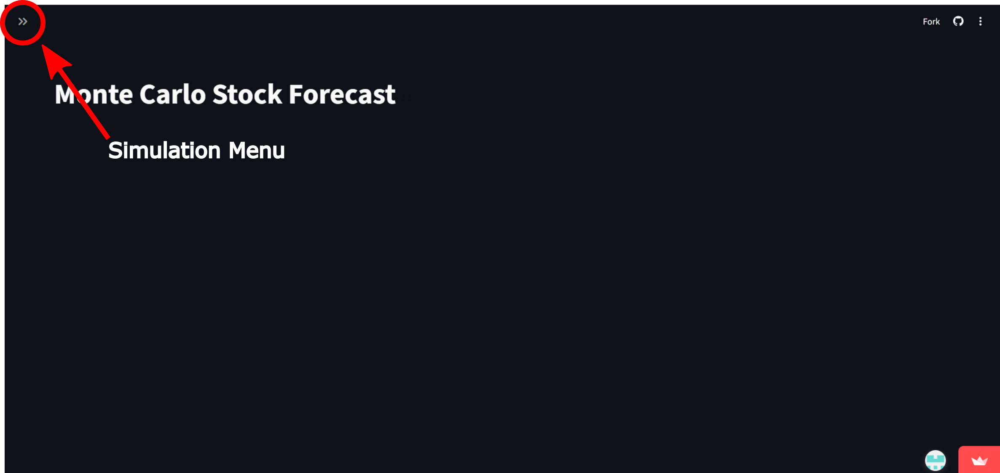
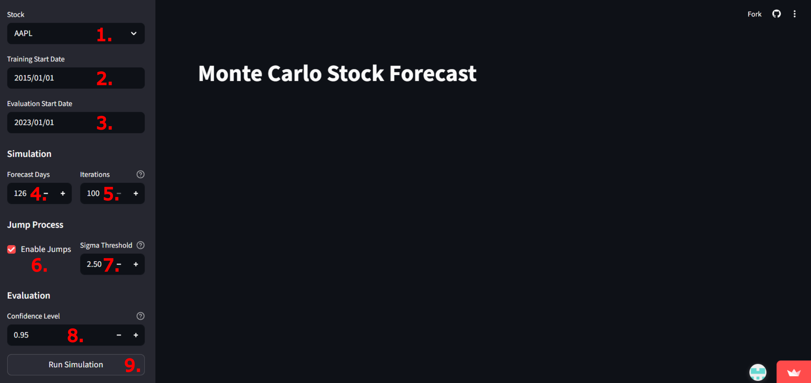
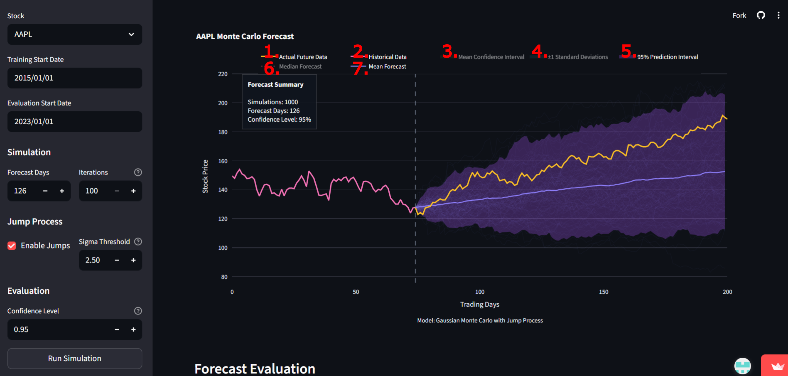

# Quantitative Market Simulator

A Gaussian-based Monte Carlo simulator designed to model possible future stock price evolution using historical market data.

**Warning: This project is intended for educational purposes only and should not be interpreted as financial advice.**

## Web Application

An interactive Streamlit-based web application equipped with a selection of stocks from various industries for simulation and evaluation.

To access the app, click [here](https://maiksmontecarlostocksimulator.streamlit.app/), or navigate to:

https://maiksmontecarlostocksimulator.streamlit.app/

To initiate a simulation, first expand the control panel by clicking the ">>" symbol in the top left corner (highlighted in the image below).



Next, adjust the parameters as desired. The current version includes the following adjustable parameters:

1. **Stock name** - Dropdown menu containing a selection of sample stocks.*
2. **Training start date** - First date of the historical stock data used to calibrate the simulation.
3. **Evaluation start date** - Final date of the training data and start date of the forecast period.**
4. **Forecast days** - Number of trading days to forecast.
5. **Iterations** - Number of Monte Carlo paths generated.
6. **Enable jumps** - Includes jump events in the simulation model when enabled.
7. **Sigma threshold** - Standard deviation multiplier used to classify extreme price movements as jumps.***
8. **Confidence level** - Controls the width of the prediction interval. For example, 0.95 indicates the interval expected to contain 95% of simulated paths.
9. **Run simulation** - Applies the selected parameters and executes the simulation.

\* The current stock selection is limited, but can easily be extended locally or upon request for the web application.

\** The Evaluation start date should not be the same or earlier than the Training start date, as this will produce invalid simulations.

\*** For example, if the multiplier is set to 2, any daily percentage stock movement exceeding 2 standard deviations is classified as a jump event.

(Note: an additional scaling factor is internally calibrated through numerical optimization.)



Finally, graph visibility can be adjusted by clicking items in the interactive legend:

1. **Actual Market Data** - Toggles the actual market data after the simulation start date.
2. **Historic Data** - Toggles the historical market data used for calibration.
3. **Mean Confidence Interval** - Toggles the confidence interval around the mean forecast.
4. **±1 Standard Deviation** - Toggles the band representing ±1 standard deviation around the mean forecast.
5. **Prediction Interval** - Toggles the interval expected to contain 95% of Monte Carlo paths.
6. **Median Forecast** - Toggles the median forecast across all Monte Carlo iterations.
7. **Mean Forecast** - Toggles the mean forecast across all Monte Carlo iterations.



Below the graph, several evaluation metrics are displayed, including:

- **RMSE (Root Mean Squared Error)** - Measures the average distance between the forecast mean and the actual market data.
- **MAPE (Mean Absolute Percentage Error)** - Measures the average percentage deviation between the forecast and actual market data.
- **Coverage** - Indicates how much of the actual market data lies within the prediction interval.
- **Jump statistics** - Compares jump behaviour between the simulated and actual market data.

## Running Locally

Clone the repository:

```bash
git clone https://github.com/YOUR_USERNAME/quantitative_market_simulator.git
cd quantitative_market_simulator
```

Create and activate a virtual environment:

### Windows

```bash
python -m venv venv
venv\Scripts\activate
```

### macOS / Linux

```bash
python3 -m venv venv
source venv/bin/activate
```

Install the required dependencies:

```bash
pip install -r requirements.txt
```

Launch the Streamlit web application:

```bash
streamlit run app.py
```

The application should automatically open in your browser. If not, navigate to the local URL shown in the terminal.

## Project structure

```text
quantitative_market_simulator/
│
├── .streamlit/
│   └── config.toml
│
├── Images/
│   └── readme/
│       └── readme/
│           ├── graph_interactives.png
│           ├── opening_menu.png
│           └── simulation_params.png
│
├── notebooks/
│   ├── case_studies.ipynb
│   ├── experimentation.ipynb
│   └── optimization.ipynb
│
├── outputs/
│   ├── case_studies.html
│   ├── case_studies.pdf
│   ├── jump_calibration_results_V1.pdf
│   ├── jump_calibration_results_V2.pdf
│   ├── jump_calibration_results_V2_fit.pdf
│   └── jump_calibration_results_V3.pdf
│
├── src/
│   ├── __init__.py
│   ├── data.py
│   ├── evaluation.py
│   ├── simulation.py
│   ├── stats.py
│   └── visualization.py
│
├── .gitignore
├── app.py
└── requirements.txt
```

## Features & Methodology
- Gaussian-based Monte Carlo stock price simulation
- Optional jump-process modelling for extreme market events
- Historical stock data retrieval using Yahoo Finance (yfinance)
- Interactive Plotly-based visualizations
- Interactive Streamlit web application
- Confidence interval estimation
- Statistical forecast evaluation metrics
- Comparison against actual market data
- Modular project structure for extensibility

## Case Studies

Several case studies were conducted across equities with different volatility profiles and market behaviours in order to evaluate both the standard Gaussian Monte Carlo framework and the jump-process extension.

The analysis included:

- **SPY** - Broad market index benchmark
- **Coca-Cola (KO)** - Stable defensive equity
- **Microsoft(MSFT)** - Mature technology company 
- **Tesla (TSLA)** - High-volatility growth stock
- **META** - Structural market shift and repricing example
- **NVIDIA (NVDA)** - AI-driven growth and momentum case study

The case studies compared Gaussian-only and jump-process simulations using metrics including RMSE, MAPE, prediction interval coverage, and jump statistics.

Full results and discussion are available in:

- [Case Study Report (PDF)](outputs/case_studies.pdf) (found in outputs/case_studies.pdf)
- [Case Study Notebook](notebooks/case_studies.ipynb) (found in notebooks/case_studies.ipynb)


## Future Work

Potential future extensions and improvements include:
- Volatility-sensitive jump calibration frameworks
- Weighted historical calibration favouring more recent market behaviour
- Alternative non-Gaussian return distributions
- Expanded stock and asset support within the web application
- Improved UI functionality and interactive visualizations

These were observed during the case studies to bring about the most substantial improvements in prediction quality within the Monte Carlo model
